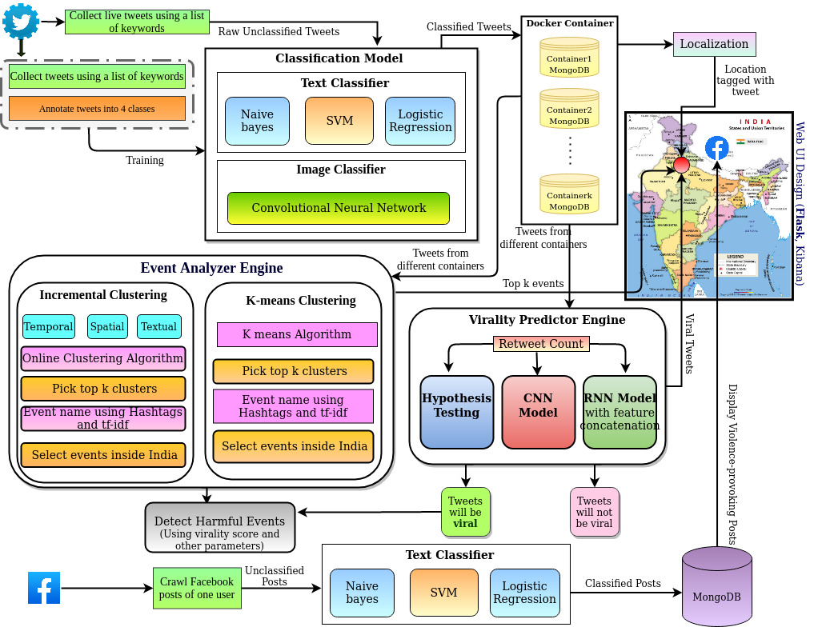

# DigiMonitor
## Developers : __Saswata Roy, Brijendra Suman, Asutosh, Ravi__
Digimonitor is a Real-Time CyberSpace Monitoring tool that uses supervised and unsupervised techniques on social media data like Twitter and Facebook. It is an integrated Real Time DigiMonitor framework which performs three major tasks in parallel. Data Collection (Task I): Continuously crawling relevant tweets and classify the tweets before storing them in database (MongoDB). Identification of important events (Task II): Continuously monitoring the tweets (last 7 days) for detecting major events dynamically. Virality Prediction (Task III): Continuously monitor the tweets and predict whether any of these tweets would become viral.

## Steps
* We prepare a set of 232 riots/violence-provoking key phrases such as “jihad kill people”, “rally riots dead” (see "Keywords.txt" file) from various news articles and wikipedia.
* We then use the Twitter streaming API to collect real time tweets with the help of the above-mentioned keywords and store all the collected tweets under N different MongoDB. Each MongoDB is kept under different Docker Containers.
* Tweets are first classified (Violence Extremism, Non-Violent Extremism, Radical-Violence, Non Radical-Violence) before storing into the database. Details of these four classes are given in the "XXX.pdf" file.
* We use K-Means Clustering Algorithm to identify top K events for Task II.
* For Virality prediction task, we chose those tweets as viral whose final retweet count is more than some predefined outbreak threshold within declaration time. (Follow the paper "Forecasting the Future: Leveraging RNN based FeatureConcatenation for Tweet Outbreak Prediction" at https://doi.org/10.1145/3371158.3371190). If you find it useful, cite us
~~~~
@incollection{roy2020forecasting,
  title={Forecasting the future: leveraging rnn based feature concatenation for tweet outbreak prediction},
  author={Roy, Saswata and Suman, Brijendra Kumar and Chandra, Joydeep and Dandapat, Sourav Kumar},
  booktitle={Proceedings of the 7th ACM IKDD CoDS and 25th COMAD},
  pages={219--223},
  year={2020}
}

~~~~
* For the Visualization purpose, we use Flask app.

## Installation Guidelines
- Step1: install mongodb 

## Code Avaialability
~~~~
Code will only be made public for the research purpose. Contact at @saswataroy.1987@gmail.com and provide valid reasons 
~~~~

## DigiMonitor Architecture

## DigiMonitor Demo

https://user-images.githubusercontent.com/99898404/192083381-b6fda5a3-ecdd-4ef2-b6e5-da0906db9c71.mp4
